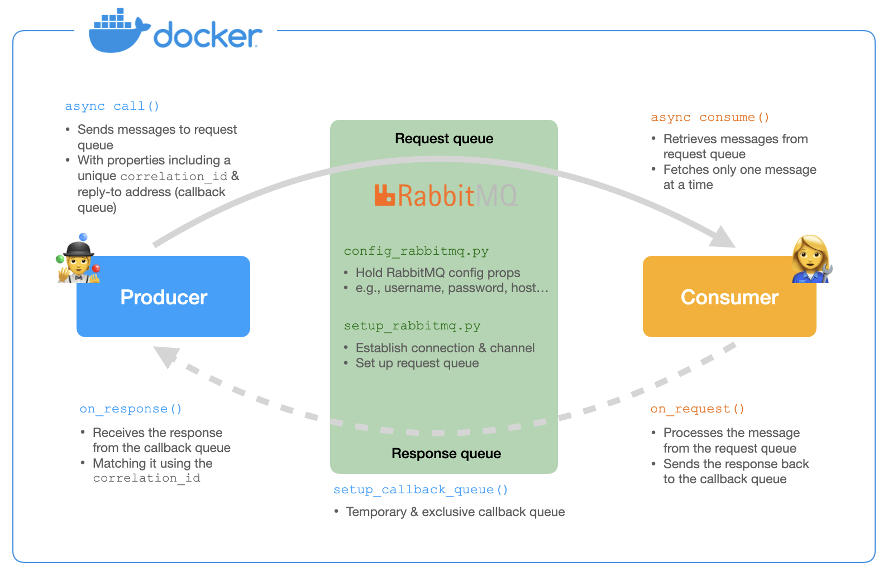
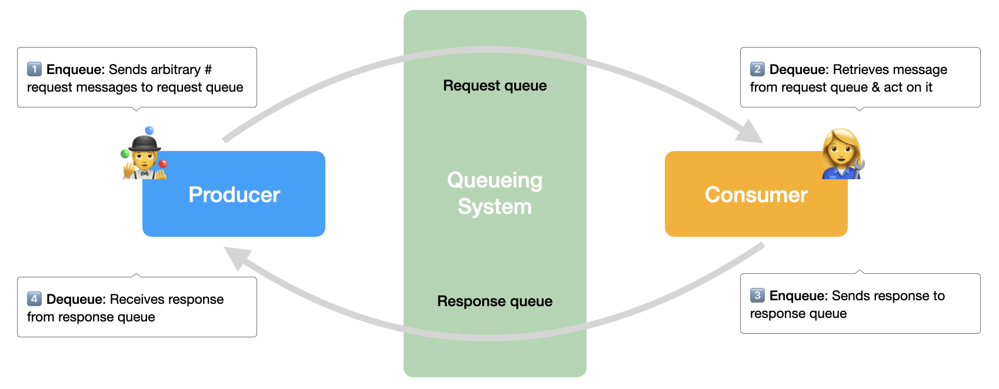
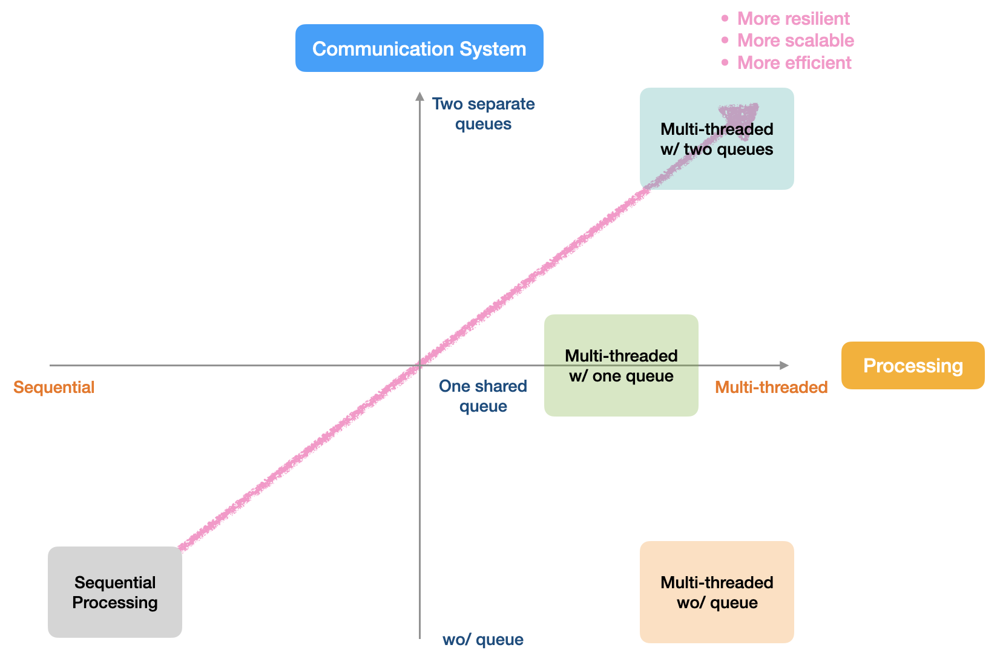

# Producer/Consumer Service Communication Based on Queueing System

## Solution Overview

## Step 1: Understand the Requirements

- **Goal**: Implement an asynchronous producer-consumer communication system

- **Expected functionalities:**

  - Implement a producer service that sends requests to a request queue
  - Implement a consumer service that processes these requests and sends responses to a response queue
  - Ensure the producer can send multiple requests concurrently
  - Ensure the consumer can process requests and send responses asynchronously

- **Other requirements:**
  - Production quality code
    - Performance, scalability, security, error handling etc.
  - Implement at least one test case

## Step 2: Define High-level System Architecture & Components

- **Producer service:**

  - Sends messages to the request queue
  - Reads responses from the response queue

- **Consumer service:**
  - Retrieves messages from the request queue and act on them
  - Processes the messages and sends responses to the response queue
- **Message queues:**
  - Request queue: Holds messages sent by the producer
  - Response queue: Holds responses sent by the consumer
    

## Step 3: Decide on Tech Stacks

### 3.1 Programming language: Python

> _Design Decision 1_

- **Decision criteria:**
  - <u>Personal proficiency</u>: Python is preferred due to my personal familiarity and development speed
  - <u>Project requirements</u>: Based on the project requirements, it seems that `Golang` would be the most appropriate programming language due to its heavy reliance on the producer-consumer pattern. However, I am not very proficient in Go😅
  - <u>Library support</u>: Good support for RabbitMQ through the `pika` library
- **Cons**: May not be as performant as compiled languages for very high throughput systems

### 3.2 Message queue system: RabbitMQ

> _Design Decision 2_

- **Decision criteria**: Based on the requirement of _production quality code_
  - <u>Scalability</u>: Handle increased load well
  - <u>Durability</u>: Messages should be persisted and recovered in case of system failures
  - <u>Latency</u>: Maintain low latency for real-time message processing
  - <u>Integration</u>: Can be easily integrated into the existing setup
  - <u>Complexity</u>: Ease of setup, maintenance, and use

|                            | Scalability              | Durability               | Latency                  | Integration              | Complexity               |
| -------------------------- | ------------------------ | ------------------------ | ------------------------ | ------------------------ | ------------------------ |
| **In-process, user-space** |                          |                          |                          |                          |                          |
| `queue.Queue`              | 
❌
 | 
❌
 | 
✅
 | 
✅
 | 
✅
 |
| `multiprocessing.Queue`    | 
❌
 | 
❌
 | 
✅
 | 
✅
 | 
✅
 |
| **External services**      |                          |                          |                          |                          |                          |
| RabbitMQ                   | 
✅
 | 
✅
 | 
✅
 | 
✅
 | 
☢️
 |
| Kafka                      | 
✅
 | 
✅
 | 
✅
 | 
✅
 | 
❌
 |
| _More other options…_      |                          |                          |                          |                          |                          |

## Step 4: Plan the Implementation

### 4.1 Docker Containerization

> _Design Decision 3_

- **Decision criteria:**
  - <u>Interoperability</u>: Ensures the system can run consistently across different environments
  - <u>Isolation</u>: Each service runs in its own container, preventing conflicts and ensuring isolation
  - <u>Scalability</u>: Easy to scale individual components (producer, consumer) independently
  - <u>Consistency</u>: The system runs the same way in any environment, reducing the “it works on my machine” problem
  - <u>Ease of deployment</u>: Simplifies the deployment process by packaging the application and its dependencies in a container

### 4.2 Set Up RabbitMQ

#### 4.2.1 Configuration

- Use a **dataclass** `RabbitMQConfig` to hold the RabbitMQ configuration properties including username, passwork, host and virtual host

> _Design Decision 4_

- **Decision criteria:**
  - <u>Organization</u>: Keeps the configuration properties organized in one place
  - <u>Type safety</u>: Provides type safety, ensuring that the configuration properties are correctly used
  - <u>Readability</u>: Makes the code more readable
  - <u>Reusability</u>: Makes it easier to reuse the configuration in different parts of the application, e.g., in producer and consumer

#### 4.2.2 Connection

- **Establishing TCP Connection**

  - When a RabbitMQ client (like a producer or consumer) starts, it establishes a TCP connection to the RabbitMQ server
  - This connection is persistent and remains open for the duration of the client’s communication with the server

- **Creating a Channel**
  - Once the TCP connection is established, the client can create multiple channels over this connection
  - Each channel acts as a lightweight communication path for sending and receiving messages

#### 4.2.3 Communication

- Channels are used for all interactions with RabbitMQ, including declaring queues, publishing messages, and consuming messages, etc.

#### 4.2.4 Closing

- After the client is done communicating with RabbitMQ, it closes the channels and the TCP connection

#### 4.2.5 Potential issue of RabbitMQ connection in Docker

- **Potential Problem:**

  - The timing of the RabbitMQ service being fully up and ready to accept connections
  - The `depends_on` directive in `Docker Compose` only ensures that the RabbitMQ service container is running, not that it is fully initialized and ready

- **Solution:**
  - Add a health check to the RabbitMQ service to ensure it is ready before other services try to connect

### 4.3 Implement the Producer Service

#### 4.3.1 Connection: establish connection to RabbitMQ

- Reuse the `RabbitMQSetup` class to create a connection and channel

#### 4.3.2 Enqueue: sends messages to request queue

- The producer service needs to be able to **send multiple messages concurrently** to the request queue
- This is achieved by handling **concurrency** using **asynchronous programming**, which allows the producer to perform multiple operations without waiting for each one to complete before starting the next

> _Design Decision 5_

|                       | 🤗 Pros                                                       | 🤧 Cons                                                     |
| --------------------- | ------------------------------------------------------------- | ----------------------------------------------------------- |
| **Async Programming** | Efficiently handles _I/O-bound_ tasks                         | Complexity in code structure and debugging                  |
|                       | Better performance for tasks involving many _waiting periods_ | Not suitable for CPU-bound tasks                            |
| **Threading**         | Suitable for _CPU-bound_ tasks                                | _Overhead_ due to context switching                         |
|                       | Simpler mental model and relatively easier to implement       | Potential issues with _thread safety_ and _race conditions_ |

#### 4.3.3 Dequeue: receives response from response queue

- To receive responses from the consumer service, the producer sets up a callback queue
  - This queue is temporary and exclusive to the connection that declares it, ensuring that responses are directed to the correct producer instance

> _Design Decision 6_

|                          | 🤗 Pros                                                        | 🤧 Cons                                                      |
| ------------------------ | -------------------------------------------------------------- | ------------------------------------------------------------ |
| **Callback Queue**       | Simplifies matching responses to requests                      | Slightly more complex setup                                  |
|                          | Ensures that each producer instance gets its correct responses | Potential overhead for creating and managing multiple queues |
| **Fixed Response Queue** | Simpler to implement                                           | Additional logic needed to match responses to requests       |
|                          | Easier to monitor and manage a single queue                    | Potential for message collision in high throughput systems   |
| **Direct Reply-To**      | Simplifies response routing                                    | Limited to certain use cases                                 |
|                          | Reduces overhead by not creating additional queues             | May require additional configuration and handling            |

### 4.4 Implement the Consumer Service

#### 4.4.1 Connection: establish connection to RabbitMQ

- Reuse the `RabbitMQSetup` class to create a connection and channel

#### 4.4.2 Dequeue: retrieves messages from request queue

- The consumer service needs to retrieve messages from the request queue and process them
  - `basic_qos(prefetch_count=1)` ensures that the consumer fetches only one message at a time
    - This prevents the consumer from being overwhelmed by too many messages and ensures that each message is processed before fetching the next one

> _Design Decision 7_

- For the process simplicity, a simulated response is generated by prepending “Consumer processed” to the received message

#### 4.4.3 Enqueue: sends responses to response queue

- After processing a message, the consumer needs to send the response back to the producer
  - This is done by publishing the response message to the callback queue specified in the properties of the original request message

## Other Ending Thoughts

### When is it appropriate to use a producer/consumer service?

- **Easily overloaded systems**

  - <u>Example</u>: A popular online store with high traffic, where orders can come in rapidly and unpredictably
  - If orders come in faster than they can be processed, system could be overwhelmed, leading to crashes or slow performance

- **Mostly idle systems**
  - <u>Example</u>: An online store where orders come in slowly and sporadically, leading to periods of inactivity
  - If orders come in slowly and process them immediately, the processing system might be idle most of the time, wasting resources

### How does a producer/consumer service come to the rescue?

- **Key**: decoupling the production of tasks from their consumption

- **For easily overloaded systems:**

  - <u>Buffering</u>: The message queue acts as a buffer, allowing the producer to send messages at a different rate than the consumer can process them
  - <u>Handling burst traffic</u>: This helps handle burst traffic, prevents overloading of the consumer, and provides a way to throttle or rate-limit message processing

- **For mostly idle systems:**
  - <u>Event-oriented architecture</u>: The event-oriented architecture, where services react to events or messages published by other services, promotes a more reactive and responsive system
  - <u>Efficient resource utilization</u>: By decoupling task production and consumption, the system can process tasks in batches or as resources become available, preventing resource wastage

### Why producer/consumer w/ queueing system? Compare & contrast w/ other options

